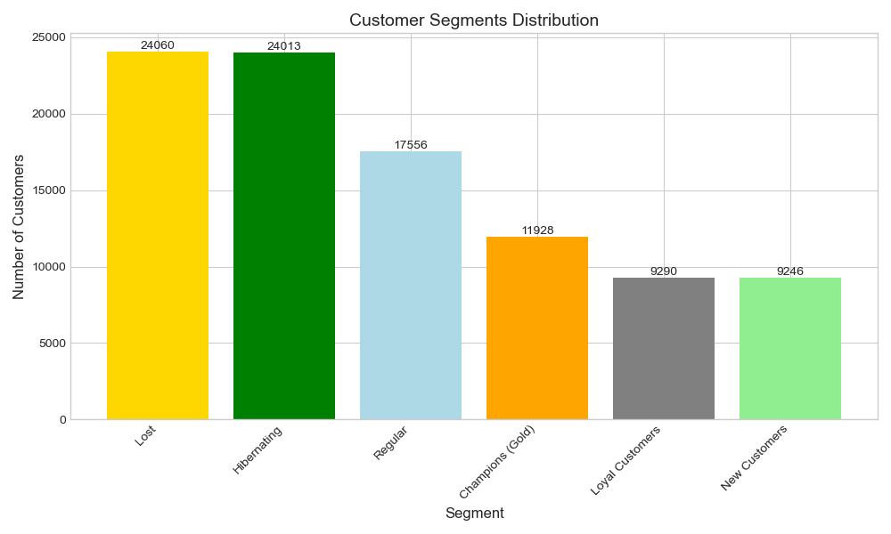
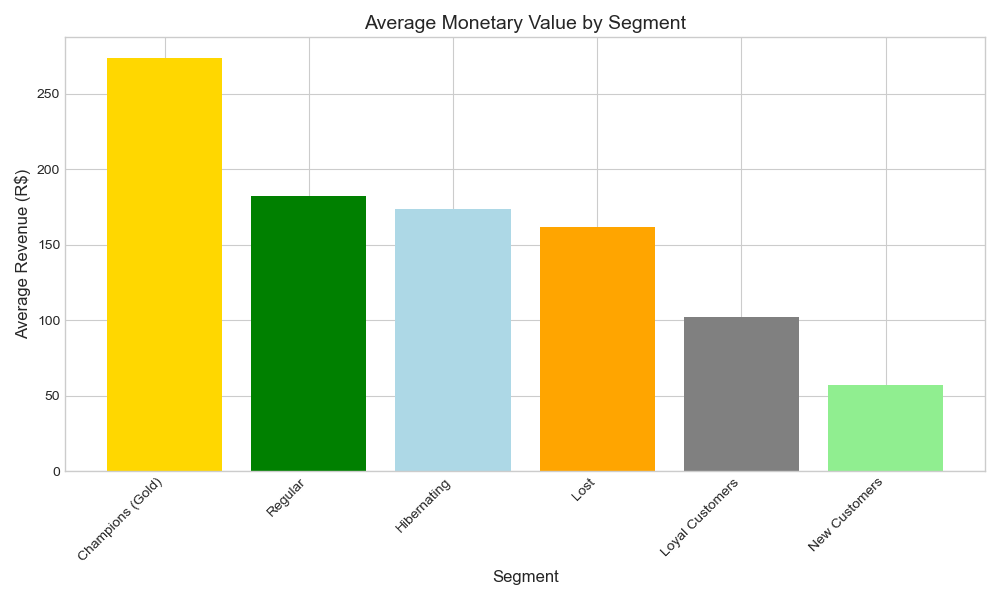

# RFM Analysis: Customer Segmentation for E-Commerce

## 📌 Project Overview
This project analyzes customer purchasing behavior using **RFM (Recency, Frequency, Monetary)** segmentation. The goal is to identify customer groups and provide actionable business recommendations.

**Tools used:** Python (pandas, numpy, matplotlib, seaborn) | Jupyter Notebook

## 📊 Key Insights

| Segment            | Number of Customers | Avg. Revenue (R$) |
|--------------------|---------------------|-------------------|
Segment                                                 
Champions (Gold)                11928             273.51
Regular                         17556             181.86
Hibernating                     24013             173.74
Lost                            24060             161.47
Loyal Customers                  9290             101.82
New Customers                    9246              57.19

## 📈 Visualizations

### Customer Segments Distribution

### Average Revenue by Segment

## 💡 Business Recommendations

1. **Champions (Gold)** → VIP program, exclusive offers, loyalty points
2. **Loyal Customers** → Cross-sell, referral programs
3. **New Customers** → Onboarding email sequence, first-purchase discount
4. **Hibernating** → Re-activation campaign with promo codes
5. **Lost** → Win-back offers (if profitable)

## 🔧 How to Reproduce

1. Clone this repository
2. Install requirements: `pip install pandas numpy matplotlib seaborn`
3. Run `01_RFM_Analysis.ipynb` in Jupyter Notebook

## 📂 Data Source
[Brazilian E-Commerce Public Dataset by Olist](https://www.kaggle.com/datasets/olistbr/brazilian-ecommerce)

## 📅 Status
✅ Completed — June 2026